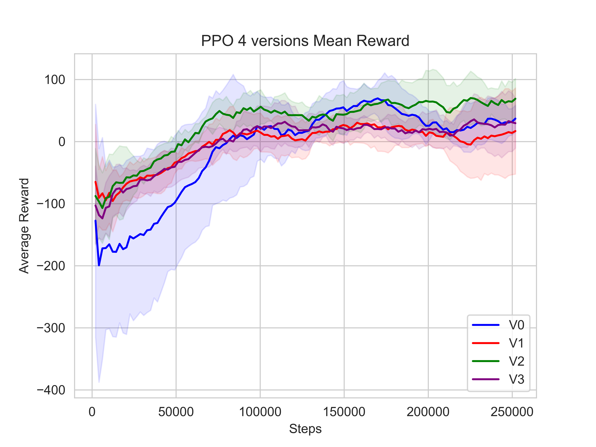

# Queen Mary University of London: DENM100 - Extended Research Project - 2023/24

- By Zhendong Liu
- ID: 200352125

Initial MIMo open source project: [MIMo](https://github.com/trieschlab/MIMo).
The following are some of the modifications made based on the MIMo open source project.

## Training Models
The code is in the `learning.py` file.
```python
env_name = 'selfbody'
alList=['PPO','TD3']
algorithm = alList[0]
save_model = 'selfbody' + algorithm+'version5.2_'+'1'
save_every = 100000
train_for = 250000
test_for = 1000
render = True
use_muscle = True

save_dir = os.path.join("models", env_name, save_model)
actuation_model = MuscleModel if use_muscle else SpringDamperModel
env = gym.make('MIMoSelfBody-v0', actuation_model=actuation_model)
env.reset()

from modify.PPOdiy import PPO as RL

# load pretrained model or create new one
model = RL("MultiInputPolicy", env,
           tensorboard_log=os.path.join("models", "tensorboard_logs", env_name, save_model),
           verbose=1)

# train model
counter = 0
while train_for > 0:
    counter += 1
    train_for_iter = min(train_for, save_every)
    train_for = train_for - train_for_iter
    model.learn(total_timesteps=train_for_iter, reset_num_timesteps=False)
    model.save(os.path.join(save_dir, "model_" + str(counter)))

test(env, save_dir, model=model, test_for=test_for, render_video=render)

```

## Evaluating Models
The model generated after training is saved locally and the trained model is evaluated using the following code. The code is in the `evaluateModel.py` file.
```python
algorithm = 'PPO'  # PPO  TD3
actuation_model = MuscleModel
env = gym.make('MIMoSelfBody-v0', actuation_model=actuation_model)

from modify.PPOdiy import PPO as RL

num='5.2_1'
load_model = 'models/selfbody/selfbody'+algorithm+'version'+num+'/model_1'
model = RL.load(load_model, env)
mean_reward, std_reward = evaluate_policy(model, env, n_eval_episodes=20,render=False)
print(f"Mean reward version{num}: {mean_reward} +/- {std_reward}")

vec_env = model.get_env()
obs = vec_env.reset()

# Evaluate
for i in range(12000):
    action, _states = model.predict(obs, deterministic=True)
    obs, rewards, dones, info = vec_env.step(action)
    # vec_env.render("human")
    # env.mujoco_renderer.render(render_mode="human")
```

## Change gear and force range
Modify the MIMo gears and the range of joint movement, the code is in the `selfbody_mate.xml` file.
```xml
name="act:right_shoulder_horizontal" gear="5" forcerange="-10 10"
```

## Touch judgement modification
Iterate over all sensors, and code in the selfbody.py file.
```python
def find_touch_max(self, sensor_output):
   touch_part=False
   max_values = {}
   for key, array in sensor_output.items():
       np_array = np.array(array)  # Convert list to NumPy array
       max_value = np.max(np_array)
       if max_value > 0:
           max_index = np.unravel_index(np.argmax(np_array), np_array.shape)
           max_values[key] = (max_value, max_index)
           touch_part = True
           self.other_part = self.model.body(self.model.geom(key).bodyid).name

   return touch_part
```

## Data collection
Training data for different versions of the model, in the `PPO5.0.csv`, `PPO5.1.csv`and so on.

## Data Visualisation
Based on the data collected, it was plotted as a learning curve as follows.


